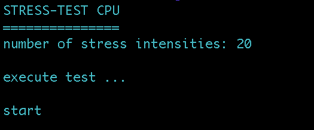

<h1 align="center">StrainForge</h1>

StrainForge is a batch script that allows you to stress test your CPU by running repeated CMD processes. The user can set the number of times the CMD processes are executed. This tool is useful for testing CPU performance under high workload conditions and for identifying any system stability issues.
